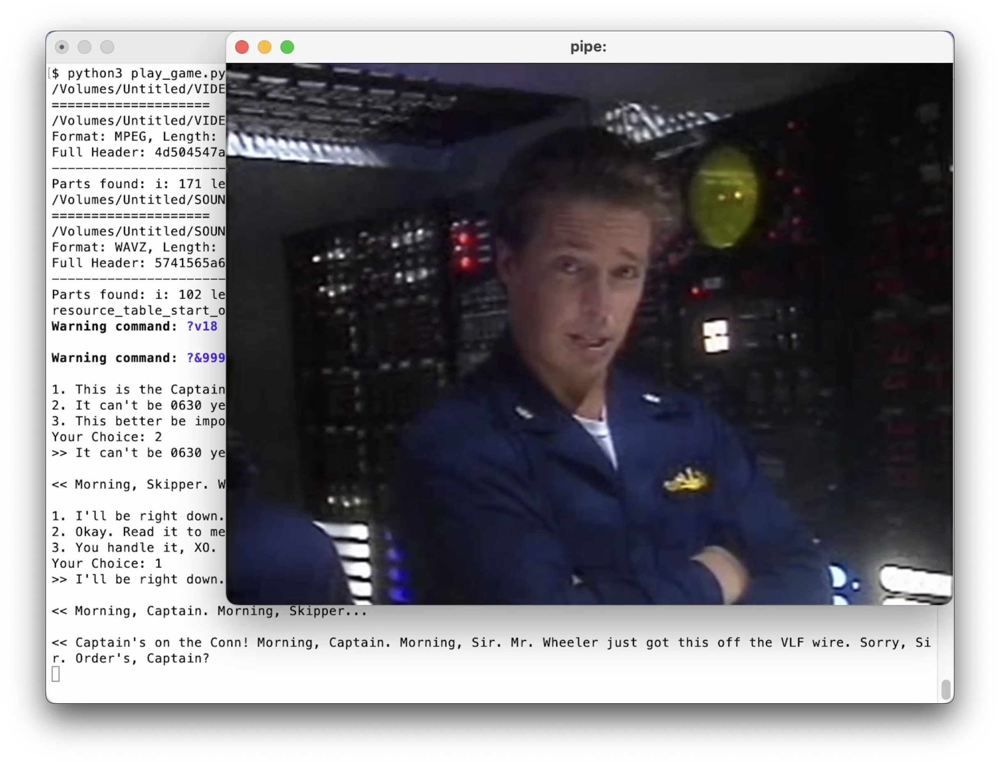
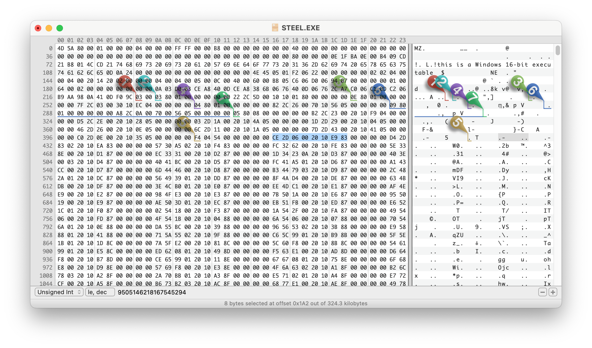

# Reverse Engineering Silent Steel

Silent Steel is a 1995 submarine simulator computer game by Tsunami Games. It was created during the influx of interactive movies during the 1990s. The game is composed almost entirely of live-action full motion video, with sparse computer-generated graphics depicting external shots of the boat during torpedo attacks and atmospheric fly-bys. More about _Silent Steel_ is available on [Wikipedia](https://en.wikipedia.org/wiki/Silent_Steel), [MobyGames](https://www.mobygames.com/game/7993/silent-steel/) and the [ScummVM Wiki](https://wiki.scummvm.org/index.php/Silent_Steel).


This project tries to reverse engineer the game files and implement a barebone interpreter in python to play the game on modern machines (it was originally released as a 16bit executable for Win 3.11) and provide documentation for a full reimplementation of the game (e.g. as a ScummVM engine).

## Status:

Much of the game is playable, but some parts of the game scripts are still not 100% understood or implemented (see below).

**[Watch the first 10min 🎬 on Youtube](https://youtu.be/tYT6yM3C5GM)**


## Compatibility:

At the moment this only supports the promotional disc available at the [Internet Archive](https://archive.org/details/silentsteeldisconepromotional) which is based on the Windows 3.1 MPEG release.

There were many releases of this game, it's not clear whether the later releases (AVI CD-ROM, DVD-ROM and DVD Video) were implemented the same way (DVD Video certainly wasn't).

## Requirements:

- **Python 3** with [nefile](https://github.com/npjg/nefile)
- `ffplay` from **FFmpeg**

## Data Formats:

### Game Executable Resources

`STEEL.EXE` is the main game executable in 16 bit [New Executable](https://en.wikipedia.org/wiki/New_Executable) format and contains all scripts as resources. This format is very well documented and there's multiple portable parsers for it. I used the [radare2 source code](https://github.com/radareorg/radare2/blob/master/libr/bin/format/ne) and [OSDEV.org Wiki](https://wiki.osdev.org/NE) for my research.

**How to parse `STEEL.EXE`:**

Thankfully, the format is not too complicated, so it's pretty straightforward to get to the scripts and the identifiers we need:

- The first `0x80` (128) bytes are the DOS Stub, we can ignore this, but have to remember to add this count to some offsets later.
- The position of the resources table is encoded at byte 35 in the header (see OSDEV link above) - byte 163 in the file.
- In our case, this byte is '00x60' or 96 in decimal. Adding this to the start of the header at 128 bytes means we now jump to byte 224.
- I'll skim over the details of the resource table, but the resources we are looking for (type `F4 04` in Ghidra, though that's actually the address of the string id - which is "DATA") start at byte 410 and theres 85 (`\x54` in the 3rd byte) of them. The first two resources look as follows: (2nd line parsed)
  
  ```
  Field:  | Offset     | Size    | Attributes   | Resource Type ID
  Raw:    | CE 2D      | 06 00   | 20 10        | E9 83
  Parsed: |   01 6E 70 |  00 30  | 1020 (,Pure) |  83E9 -> 03E9 -> ID: 1001
  Raw:    | D4 2D      | 83 02   | 20 10        | EA 83
  Parsed: |   01 6E A0 |   14 18 | 1020 (,Pure) |  83EA -> 03EA -> ID: 1002
  ```
  - **Size and Offset** need to be left shifted according to the exponent encoded at the start of the resource table. (byte 224 which is x03 in our case). FYI: the offset is relative to the start of the file, not the Windows header like most of the other offsets. Example:
    - _Size 1:_ `06 00` (Little Endian/LE) 0000 0110 0000 0000, Big Endian/BE: 0000 0000 0000 0110, lshift by 3 -> 0011 0000 -> size is `00 30`
    - _Offset 1:_ `CE 2D` (LE) 1100 1110 0010 1101, BE: 0010 1101 1100 1110, shift by 3: 1 0110 1110 0111 0000 -> offset is `01 6E 70`
    - _Size 2:_ `83 02` (LE), BE: x02x83, 0000 0010 1000 0011, by 3: 0001 0100 0001 1000 \_> size is `14 18`
    - _Offset 2:_ `D4 2D` (LE),BE: x2DxD4, 0010 1101 1101 0100, by 3: 1 0110 1110 1010 0000 -> offset is `01 6E A0`
  - **Resource Type ID**: This is an integer type if the high-order bit is set (8000h); otherwise, it is an offset to the type string. In our case these are always integers for the resource types we care about.

In the end and way too late, I discoverd the amazing [nefile](https://github.com/npjg/nefile) which does this all for us, and which is what I ended up using for the player.

### Game Scripts

Once extracted, the game scripts follow a simple syntax. To explain, lets go through the start of the promo disc:

**Resource 1001:**

```
{
    sequence > ?v18 > ?r$1001; > ?j1002
}
```

This means that in sequence, three things will happen:

- `?v18`: Unknown meaning
- `?r$1001;`: Play video 1001 (if there's text after `;` print it out as subtitles).
- `?j1002`: Jump to resource 1002

**Resource 1002:**

```
{
    sequence > ?&9999 > ?r$1002;
}
```

- `?&9999`: Unknown meaning (video maybe a marker for savegames/checkpoint?)
- `?r$1002;`: Play video 1002, again no subtitles

```
 1 EXCHANGE {
    + !0001This is the Captain. {
       > ?r$1003;Captain, sorry to wake you. We just received an urgent message from COMSUBLANT.
   }
   [...]
    = !0002It can't be 0630 yet. XO, what's up? {
       > ?r$1004;Morning, Skipper. We just received an urgent message from COMSUBLANT.
   }
   [...]
    - !0003This better be important. {
       > ?r$1005;Good morning, Sir. We just received urgent traffic from COMSUBLANT.
   }
   [...]
}
```

This is the first time the player gets to make a decision:

- `1 EXCHANGE` marks the start of an exchange (player controlled dialogue).
  - Exchanges are played sequentially, but can be skipped with a jump instruction (see below).
  - The player always has three dialogue lines to choose from, encoded as strings starting with `+`,`=` or `-` follow by an exclamation mark and a four digit number indicating the index of the segment for the voice track followed by the dialogue line as text.
  - After each dialogue line, three possible consequences are lined up. Encoding is the same as the sequence discussed initially. In this case it's a video (`r$1003`,`r$1004` or `r$1003`) with subtitles, but it can also be multiple segments (separated by `>`) and include jumps (in which case the exchange is over).
  - Often all three consequences are the same (which is why i removed them from the snippet above), but sometimes there's different ones which presumably get picked randomly.

```
 2 EXCHANGE {
    + !0004I'll be right down. {
       > ?r$1012;Morning, Captain. Morning, Skipper... > ?j2001
   }
   [...]
}
```

- This consequence has a jump (`?j2001) meaning that this choice ends the exchange and the game continues at resource 2001.

#### Other instructions

Later in the script, a few more unknown instructions are used, it's unclear what the following instructions mean:

- `?v` - this actually only appears once right at the beginning of the game (`?v18` see above)
- `?s0100` - actually no other `?s` instruction is used in the promo disc. appears 15 times.
- `?&` - appears many (61) times in the promo disc, nothing actually seems to happen in the original game at these points in the game - maybe it's a savegame state?
- `?*` - appears 45 times, could also be an alternative video play or jump instruction? it has multiple comma-separate numbers following it (instead of a single number for the previously discussed instructions). maybe a sequence of videos or a random jump?
- `?g` - appears 50 times, could also be an alternative video play or jump instruction? it has multiple comma-separate numbers following it. maybe a sequence of videos or a random jump?

### Media Files

`VIDEO1.MPG` contains all the video shown in the game. It's a concatenation of many [MPEG-PS](https://en.wikipedia.org/wiki/MPEG_program_stream) streams, each with their own MPEG-PS header (easily identifiable in the file by their sync bytes `00 00 01 BA`). For our purposes we don't care about the header content as we directly pass the streams cut to the offset of the selected index we found in the index file to `ffplay`.

`SOUNDS1.WAV` contains all audio lines from the protagonist (usually played based on the choice by the player). It's a simple https://en.wikipedia.org/wiki/WAV File with a single PCM encoded audio stream. As the offsets in the index file are are byte based, we convert the offsets into a timestamp (easily done based on bitrate as there is no compression) before passing the full file to `ffplay`.

`VIDEO1.IDX` and `SOUNDS1.IDX` are indexes for the above two files. They contain a list of indexes used in the game scripts and file offsets for each media segment. From what I can tell, the media segments are not overlapping (although there's a lot of duplicated content) and the offsets mark both start of an segment as well as the end of the previous segment.

**Format of `.IDX` files**: Both audio and video index files are formatted the same way, they start with a 16 byte header and then 6 byte fields for each segment index and offset.

- Header Format: (16 bytes)
  | **Start** | **Length** | **Description** |
  |------- |--------- |-------------------------------------------- |
  | 0 | 4 bytes | Media Format in ASCII. Either `WAVZ` or `MPEG`. |
  | 4 | 8 | _unknown_ |
  | 12 | 2 | last index as little endian integer |
  | 14 | 2 | _unknown_ |
- Segment Format: (6 bytes)
  | **Start** | **Length** | **Description** |
  |------- |--------- |-------------------------------------------- |
  | 0 | 2 bytes | Index as little endian integer |
  | 2 | 4 | File offset for index as little endian integer |

## Additional Tools Used:

- [Ghidra](https://ghidra-sre.org/) to browse the resources and poke around a bit - didn't decompile anything really.
- [UTM](https://github.com/utmapp/UTM) to emulate a PC from the era and run Windows 98 (couldn't get Windows 95 running)
